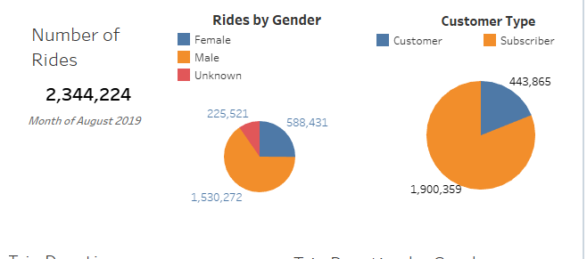
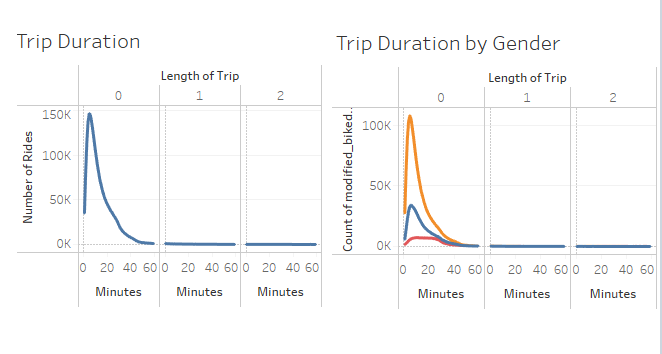

# Citi Bike Analysis
## Overview and Purpose of Analysis
The purpose of this analysis is to determine feasability for opening a Citi Bike operation in Des Moines Iowa.  
To accomplish the analysis data from the New York operations were analyzed for the month of August.  August should be close to a peak month and can provide insight regarding usage volumes and customer preferences.
Specifically the analysis will look at:
-  Number of rides 
-  Volume of rides by gender
-  Volume of rides by Customer Type
-  Duration of rides in total and by gender
-  Usage by hour of day and day of week in total and by gender
-  Hours of most utiliztion 
-  Volume of where trips are started and completed

## Results of Analysis
The summary results of the August data can be seen in the figure below.

The total number of rides for August was 2.3M.  Most of the rides, 65% or 1.5M, were taken by Men.  Over 85% of the rides were taken by "Subscriber" customer type.  Most of the "Unknown" gender were of customer type "Customer".  The intial conclusions from these visuals are that Men represent the vast majority of the riders in August and they are regular subscribers to the Citi Bike service.

 
 The next part of the analysis was to exmaine duration of trips overall and by gender.  The visuals above, show both sets of data.  The trip duration overall shows that most of the trips are less than forty minutes in length.  The most frequent durations are all less than twenty minutes and centered about ten minutes in length.
  The trip durations by gender are similar in behavior to the totals for men and women.  On average men have some longer trips than women.  The "Unknown" gender which are mostly "Customer" type users, have more uniform trip times between approximately  five and thirty minutes.

All of the visuals as part of a Tableau Story can be seen at the following links:

[This a link to Summary Story](https://public.tableau.com/app/profile/bill.remy/viz/Mod14Challenge_16557427414530/CitiBikeOverview?publish=yes)
[This is a link to the Usage Story)(https://public.tableau.com/app/profile/bill.remy/viz/Mod14Challenge_16557427414530/CitiBikeUsage?publish=yes)
